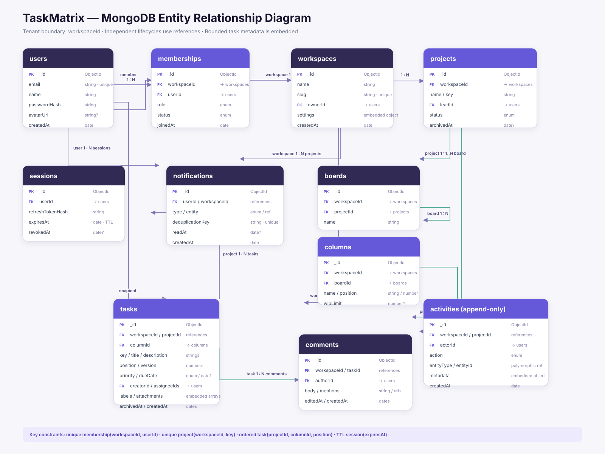

# TaskMatrix

> A commercial-grade agile project management platform for software teams to plan work, collaborate in real time, and deliver projects predictably.


## Project Overview

TaskMatrix is a Jira/Asana-inspired workspace for engineering teams. It centralizes projects, drag-and-drop Kanban boards, task ownership, deadlines, comments, and activity history in one role-aware product. The capstone focuses on the workflow from creating a project to moving an assigned task through delivery while preserving a reliable audit trail.

This repository currently contains the **Sprint 13 product blueprint**. Functional application development begins after the planning, architecture, and design review is approved.

## Designated Track

**Fullstack Engineering**

The project will demonstrate responsive product design, typed frontend development, API design, authentication and authorization, MongoDB data modeling, background jobs, real-time events, automated testing, and cloud deployment.

## Problem Statement

Small and growing software teams often split planning, ownership, deadline tracking, and status communication across several tools. This creates unclear accountability, stale progress reports, and lost context. TaskMatrix provides a single source of truth where every task has an owner, priority, due date, workflow state, and traceable history.

## Product Goals

- Make current project status understandable in under 30 seconds.
- Allow an authorized user to create, assign, prioritize, and move a task without leaving the board.
- Preserve a searchable activity history for important task changes.
- Enforce workspace and project permissions on both the UI and API.
- Deliver a responsive, accessible experience for desktop and mobile users.

## Non-Goals for the Initial Release

- Replacing source-control or CI/CD platforms.
- Complex portfolio budgeting and resource forecasting.
- Native mobile applications.
- Marketplace integrations or custom workflow automation builders.
- Multi-region enterprise data residency.

## Target Users and Roles

| Role | Primary needs | Key permissions |
| --- | --- | --- |
| Workspace Admin | Configure the workspace and team access | Manage members, roles, projects, and workspace settings |
| Project Manager | Plan and monitor delivery | Create projects, manage boards, assign tasks, and view reports |
| Team Member | Execute assigned work | Create and update tasks, comment, attach files, and move permitted cards |
| Viewer | Follow progress safely | Read projects, boards, tasks, and activity only |

## Proposed Tech Stack

| Layer | Technology | Purpose |
| --- | --- | --- |
| Language | TypeScript | Shared type safety across frontend and backend |
| Web application | Next.js 15 + React | App Router, server rendering, routing, and frontend UI |
| Styling | Tailwind CSS | Responsive styling and reusable design tokens |
| Client state | Zustand | Board interaction and lightweight global UI state |
| Server data | TanStack Query | Fetching, caching, invalidation, and optimistic updates |
| API | Node.js + Express.js | Versioned REST API and middleware pipeline |
| Database | MongoDB Atlas + Mongoose | Document storage, validation, indexes, and references |
| Authentication | JWT access/refresh tokens + bcrypt | Secure sessions and password hashing |
| Authorization | RBAC middleware | Workspace- and project-level permission enforcement |
| Real time | Socket.IO | Board changes, presence, and activity notifications |
| Background jobs | node-cron | Deadline reminders and overdue-task processing |
| File storage | Cloudinary | Task attachment storage and transformations |
| Validation | Zod | Runtime validation and shared request contracts |
| Testing | Vitest/Jest, React Testing Library, Supertest | Unit, component, and API integration tests |
| Quality | ESLint, Prettier, Husky | Consistent code and pre-commit checks |
| Deployment | Vercel, Render, MongoDB Atlas | Frontend, API, and managed database hosting |
| Monitoring | Sentry | Client and API error tracking |

## Prioritized Core Features

### P0 — Mandatory MVP

1. **Secure authentication:** Register, sign in, sign out, refresh sessions, and reset password.
2. **Role-based access control:** Admin, Project Manager, Member, and Viewer permissions enforced server-side.
3. **Workspace and project management:** Create a workspace, invite members, and create/update/archive projects.
4. **Kanban board:** Configurable columns with drag-and-drop task movement and persisted ordering.
5. **Task lifecycle:** Create, view, edit, assign, prioritize, label, set due date, and archive tasks.
6. **Comments and activity history:** Team discussion plus an append-only record of important changes.
7. **Responsive UX:** Accessible desktop, tablet, and mobile layouts with loading, empty, and error states.

### P1 — Priority Enhancements

1. Real-time board updates and activity notifications with Socket.IO.
2. Search and filtering by assignee, priority, label, status, and due date.
3. Deadline reminder and overdue-task jobs.
4. Task attachments through Cloudinary.
5. In-app notification center with read/unread state.
6. Dashboard metrics for workload, overdue tasks, and completion trend.

### P2 — Advanced Enhancements

1. Reusable project templates.
2. Task dependencies and blockers.
3. Saved filters and custom views.
4. CSV export and project summary reports.
5. Audit-log export for administrators.
6. GitHub integration for linking pull requests and commits.

## Core User Stories and Acceptance Criteria

### Authentication and access

- As a user, I can sign in and remain authenticated after a page refresh.
- As an administrator, I can change a member's role.
- A Viewer receives `403 Forbidden` when attempting a protected write through either the UI or direct API request.

### Kanban workflow

- As a Project Manager, I can create a task with title, description, priority, assignees, labels, and due date.
- As a permitted member, I can move a card between columns and the new column and order persist after refresh.
- Two clients viewing the same board receive the authorized task-move event without a manual refresh.

### Collaboration and accountability

- As a team member, I can comment on a task and mention its collaborators.
- Assignment, status, priority, and deadline changes create activity records containing actor, action, target, and timestamp.
- A deadline job marks overdue open tasks and generates one deduplicated notification per reminder window.

## Primary User Flow

1. A user registers or signs in.
2. The user creates or joins a workspace.
3. An authorized member creates a project and opens its default board.
4. The manager creates tasks and assigns team members.
5. Members move work across `Backlog`, `To do`, `In progress`, `Review`, and `Done`.
6. Comments, task changes, and board movements appear in the activity feed.
7. Deadline jobs create reminders while dashboards surface delivery risk.

## UI/UX Wireframes

The Figma design includes three core desktop viewports and reusable foundations:

1. **Authentication:** focused sign-in experience with validation and recovery path.
2. **Project Kanban Board:** global navigation, project context, filters, five workflow columns, and realistic task cards.
3. **Task Details:** editable task content, ownership metadata, comments, and activity history.

**Figma file:** [TaskMatrix — Sprint 13 UI/UX Blueprint](https://www.figma.com/design/phWFanBE1OOM569cesUesa)

Local review exports:

- [Authentication screen](docs/wireframes/auth-screen.svg)
- [Kanban dashboard](docs/wireframes/kanban-dashboard.svg)
- [Task details](docs/wireframes/task-details.svg)

## System Architecture

The client communicates with a versioned REST API for commands and queries. Socket.IO distributes authorized project events after the API commits changes. Background jobs operate on indexed due dates and create deduplicated notifications. Cloudinary stores file binaries; MongoDB stores only attachment metadata and references.



### Collection Strategy

- References are used where documents have independent lifecycles or unbounded growth, such as tasks, comments, activities, and notifications.
- Small bounded values, including labels and attachment metadata, are embedded in the owning document.
- Activity records are append-only and indexed by workspace, project, and creation time.
- Tasks use a numeric `position` within a column to support ordered drag-and-drop updates.
- Every tenant-owned document includes `workspaceId`; API queries never trust a workspace ID without membership validation.

### Critical Indexes

| Collection | Index | Reason |
| --- | --- | --- |
| users | `{ email: 1 }` unique | Login and account uniqueness |
| workspaces | `{ slug: 1 }` unique | Stable workspace routing |
| memberships | `{ workspaceId: 1, userId: 1 }` unique | Prevent duplicate membership and authorize requests |
| projects | `{ workspaceId: 1, key: 1 }` unique | Human-readable task keys scoped to a workspace |
| tasks | `{ projectId: 1, columnId: 1, position: 1 }` | Ordered board reads |
| tasks | `{ workspaceId: 1, assigneeIds: 1, dueDate: 1 }` | Workload and deadline queries |
| activities | `{ projectId: 1, createdAt: -1 }` | Recent project activity feed |
| notifications | `{ userId: 1, readAt: 1, createdAt: -1 }` | Notification center |

## Planned REST API

All routes are prefixed with `/api/v1`. Protected routes require an access token and membership authorization.

| Method | Endpoint | Purpose |
| --- | --- | --- |
| POST | `/auth/register` | Create account |
| POST | `/auth/login` | Start session |
| POST | `/auth/refresh` | Rotate access token |
| POST | `/auth/logout` | Revoke refresh session |
| GET | `/workspaces` | List the current user's workspaces |
| POST | `/workspaces` | Create workspace |
| POST | `/workspaces/:workspaceId/invitations` | Invite a member |
| PATCH | `/workspaces/:workspaceId/members/:userId` | Change role |
| GET | `/workspaces/:workspaceId/projects` | List projects |
| POST | `/workspaces/:workspaceId/projects` | Create project |
| GET | `/projects/:projectId/board` | Load board, columns, and task summaries |
| POST | `/projects/:projectId/tasks` | Create task |
| GET | `/tasks/:taskId` | Load full task details |
| PATCH | `/tasks/:taskId` | Update task fields |
| PATCH | `/tasks/:taskId/move` | Move and reorder a task |
| POST | `/tasks/:taskId/comments` | Add comment |
| GET | `/projects/:projectId/activities` | Read project activity feed |
| GET | `/notifications` | Read current user's notifications |
| PATCH | `/notifications/:notificationId/read` | Mark notification as read |

## Real-Time Event Contract

| Event | Payload summary | Audience |
| --- | --- | --- |
| `task.created` | Project, column, and task summary | Authorized project members |
| `task.updated` | Task ID, changed fields, actor, version | Authorized project members |
| `task.moved` | Task ID, source/target column, position, version | Authorized project members |
| `comment.created` | Task ID and comment summary | Authorized project members |
| `notification.created` | Notification summary | Target user only |

The REST API remains the source of truth. Events are emitted only after successful persistence. Each mutable record carries a version so clients can invalidate stale optimistic state.

## Security and Privacy Plan

- Hash passwords with bcrypt and never return password hashes.
- Store refresh tokens as revocable hashed session records; keep access tokens short-lived.
- Validate all request bodies, route parameters, and environment variables with Zod.
- Enforce RBAC and workspace membership in API middleware, not only in the UI.
- Apply rate limits to authentication, invitation, upload, and comment endpoints.
- Restrict file types and sizes and use signed Cloudinary upload rules.
- Use HTTP-only, secure, same-site cookies where the deployment architecture permits.
- Sanitize rich text and render user-generated content safely.
- Keep secrets in deployment environment variables and exclude them from Git.
- Record security-sensitive changes in append-only activity data.

## Accessibility and UX Standards

- Target WCAG 2.1 AA color contrast.
- Provide keyboard-accessible board alternatives in addition to pointer drag-and-drop.
- Use visible focus indicators, semantic landmarks, and correctly associated labels.
- Never communicate priority or status through color alone.
- Announce task movement and validation results to assistive technology.
- Design explicit loading, empty, error, permission-denied, and offline states.

## Testing Strategy

- **Unit tests:** permissions, validators, position calculations, deadline rules, and utility functions.
- **Component tests:** forms, filters, task cards, dialogs, and keyboard interactions.
- **API integration tests:** authentication, tenant isolation, RBAC, task movement, comments, and pagination.
- **End-to-end tests:** sign-in, create project, create/assign/move task, comment, and logout.
- **Non-functional checks:** accessibility audit, responsive review, API rate-limit behavior, and basic performance profiling.

## Five-Week Delivery Roadmap

| Week | Outcome |
| --- | --- |
| Sprint 13 | Approved PRD, Figma wireframes, MongoDB ERD, API plan, and AI prompt log |
| Week 2 | Repository foundation, design system, authentication, RBAC, and workspace/project APIs |
| Week 3 | Kanban board, task CRUD, drag-and-drop persistence, comments, and activity records |
| Week 4 | Real-time events, deadline jobs, filters, notifications, attachments, and test coverage |
| Week 5 | Accessibility and performance hardening, deployment, monitoring, QA, and final demo |

## Definition of Done for Sprint 13

- [x] Project and Fullstack track selected.
- [x] Product scope and prioritized feature list documented.
- [x] Complete proposed technology stack documented.
- [x] Three core high-fidelity viewport designs prepared.
- [x] MongoDB collections and relationships mapped in an ERD.
- [x] Architecture image embedded in this README.
- [x] Planned API and real-time contracts documented.
- [x] AI architecture queries recorded in `Prompts.md`.
- [ ] Public Figma sharing link verified in a signed-out browser.
- [ ] Public GitHub repository URL verified in a signed-out browser.
- [ ] Three-minute walkthrough video recorded and uploaded.

## Repository Structure

```text
prodesk-capstone-taskmatrix/
├── README.md
├── Prompts.md
├── DEMO_SCRIPT.md
├── LICENSE
└── docs/
    ├── architecture/
    │   └── taskmatrix-erd.svg
    └── wireframes/
        ├── auth-screen.svg
        ├── kanban-dashboard.svg
        └── task-details.svg
```

## AI Usage Documentation

Architectural queries, reasoning goals, adopted decisions, and human validation checks are documented in [Prompts.md](Prompts.md). AI output is treated as a draft: product scope, access rules, data model, and security decisions require human review before implementation.

## License

This planning repository is available under the [MIT License](LICENSE).

